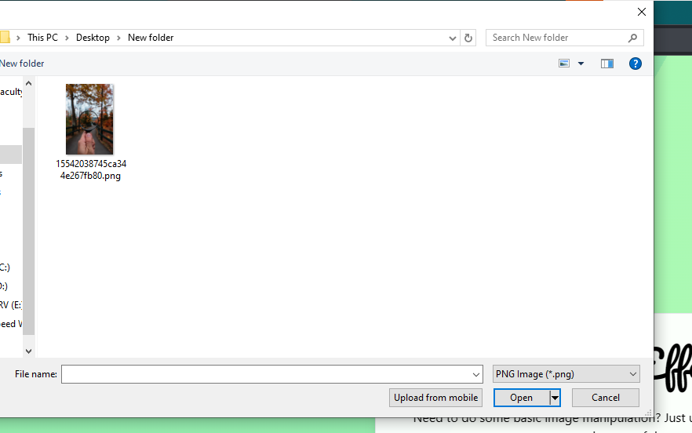

# Image Editor using WebAssembly

This project is an image editor that uses WebAssembly (WASM) compiled with Webpack from Rust and JavaScript.

## Project Structure

The project is structured as follows:

- `src/`: This directory contains the Rust and JavaScript source files.
- `dist/`: This directory contains the compiled WASM and bundled JavaScript files.

## Prerequisites

- Rust
- wasm-pack
- Node.js
- npm

## Usage

- The Web-APP is using WASM to edit the Image to convert the images to GrayScale Images With a blur Effect Fore Lens Depth

- The project is deployed on Vercel Running on the followoing link "https://imageeffectswasm-mny8tdn0m-bassel-tahas-projects.vercel.app/"

## Setup and Installation

1. Clone the repository: `git clone https://github.com/yourusername/image-editor-wasm.git`
2. Navigate to the project directory: `cd image-editor-wasm`
3. Install the dependencies: `npm install`
4. Build the project: `npm run build`

